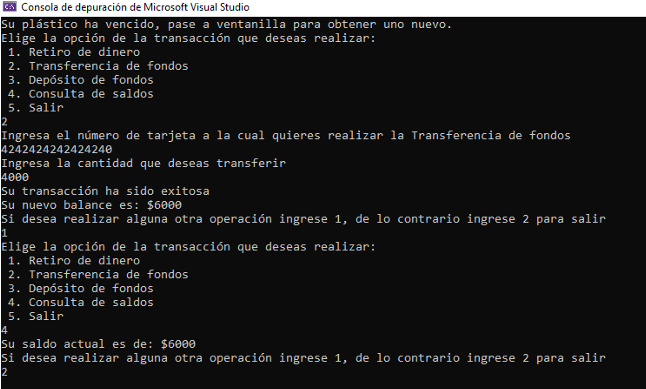

# Cajero_ATM
Simulación de Cajero ATM, se realizarán operaciones y consultas en base a información predeterminada y proporcionada por el usuario.

### Planteamiento del problema: 
Trabajas para una empresa de desarrollo de software, y te piden dar una solución que se encargue de administrar cajeros automáticos. 

Los casos de uso son los siguientes: 

+ **Retiro de dinero:** el cliente podrá retirar su dinero siempre y cuando cuente con los fondos suficientes, el número de tarjeta y pin coincidan, y su tarjeta no esté vencida. 
+ **Transferencia de fondos:** transferir dinero entre diferentes cuentas que se encuentren registradas como válidas. Se podrá realizar la transferencia de fondos, siempre y cuando la cantidad solicitada se tenga en la cuenta. 
+ **Depósito de fondos:** para depositar dinero a una cuenta se requiere el número de tarjeta a depositar y el monto. Se aceptan billetes únicamente, se debe especificar el monto a depositar, solicitar introducir billetes y realizar la validación, en caso de incumplir, se debe permitir modificar el monto a depositar. 
+ **Consulta de saldos:** el usuario podrá consultar en pantalla su saldo, solo si su número de tarjeta coincide con su pin. En caso de que la tarjeta esté vencida, se debe mostrar en pantalla el siguiente texto: “Su plástico ha vencido, pase a ventanilla para obtener uno nuevo.”. 

El banco nos ha proporcionado la siguiente información que representa los datos que ellos manejan: 

También piden que cuando el cliente verifique su saldo pueda imprimir su comprobante en un archivo de texto, mismo que el proveedor de infraestructura tendrá configurado para imprimirlo físicamente (nosotros interpretamos que enviarlo a un archivo de texto es lo mismo que imprimir). 

### Tecnologías que se utilizaron:
**Microsoft Visual Studio:** Para desarrollar el código del programa.

### Elementos del Programa: 
+ **Estructuras de Control Cíclicas:** For, Do-While, While
+ **Estructuras Condicionales y Selectivas:** SI, SI Anidado, Switch-case
+ **Expresiones Booleanas:** AND, OR, NOT
+ **Arreglos**
+ **Manipulación de archivos**

## Se generaron las siguientes pruebas: 
**1.** Retirar Dinero y después consultar el saldo de la misma cuenta

**2.** Tarjeta Vencida 

**3.** Realizar un depósito a una cuenta existente 

**4.** Realizar una transferencia y revisar el saldo después

**5.** Confirmar que solo acepta billetes

**6.** Imprimir Recibo

Generación del Recibo en Archivo de Texto

